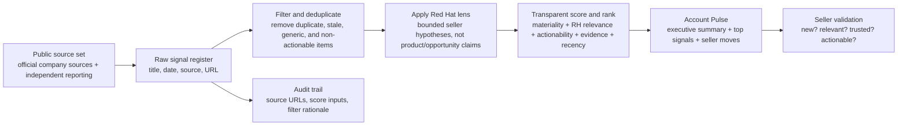
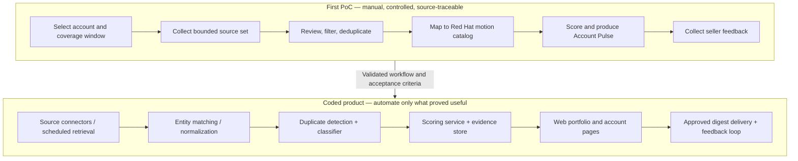
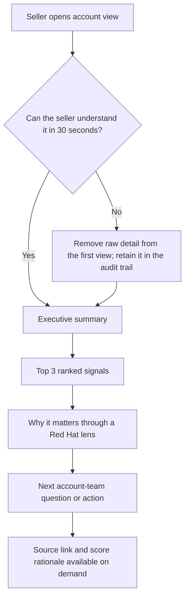

# First PoC — Visuals and Build Blueprint

## 1. First PoC flow

## 2. Clear boundary: manual POC versus coded product

## 3. Seller-first information hierarchy

## 4. Product acceptance criteria

| Criterion | Test |
|---|---|
| Seller usability | A seller can state: what changed, why it matters, and what should be validated next without opening the raw register. |
| Traceability | Every surfaced signal has a publication date, source URL, factual summary, score inputs, disposition, and a written rationale. |
| Relevance discipline | Generic content, duplicates, stale items, and events with no Red Hat-relevant action are retained in the audit trail but do not interrupt sellers. |
| No invented account claims | Product output states hypotheses and discovery questions; unproven account needs, architecture, opportunity, or buying intent remain UNKNOWN. |
| Automation readiness | The manual POC maps directly to the later functions: retrieval, normalize, dedupe, classify, rank, publish, and collect feedback. |

## 5. What is deliberately **not** in the first PoC

- RAG or vector database
- MCP server
- Autonomous agents
- CRM writeback
- Automatic Gmail send
- Internal Red Hat account data
- Enterprise deployment, SSO, or role-based access control

Those items are only justified after the seller output proves useful and the required access, ownership, governance, and data controls are known.
