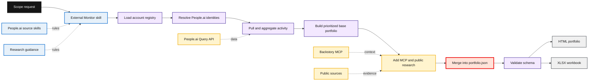

# Architecture

Red Hat External Monitor is currently a file-based, agent-orchestrated account-intelligence workflow. It is not a deployed application, a continuously running monitor, or a service. A run starts with a requested account scope, produces inspectable JSON artifacts at each major stage, and finishes with one validated `portfolio.json` that drives the available HTML and XLSX views.

The repository separates policy, connected reasoning, and deterministic state changes so that a reviewer can see which source established each fact and how the final portfolio was assembled.

## System at a glance

This diagram shows the normal research-enabled path. The registry establishes the account population, the Query API supplies broad structured activity, and deeper sources are applied only after an internally prioritized base portfolio exists.

## Responsibilities and boundaries

| Concern | Current implementation | Boundary to preserve |
|---|---|---|
| Workflow policy | `skills/external-monitor-account-intelligence/SKILL.md` | A skill is an instruction set for an agent runtime, not an executable service. It defines sequence, selection, source boundaries, and fallbacks. |
| Source-specific behavior | `skills/people-ai/` | The People.ai source skills are authoritative for Query API field catalog, authentication behavior, MCP windows, credit rules, and vendor limitations. |
| Connected reasoning | The authenticated main agent and, where allowed, research subagents | Handles ambiguous identity resolution, MCP collection and synthesis, and public-source assessment. It must not turn evidence into unqualified facts. |
| Deterministic work | Python scripts under `skills/external-monitor-account-intelligence/scripts/` | Filters, packet construction, aggregation, joins, scoring, merging, validation, and rendering stay reproducible and file based. |
| Structured internal retrieval | People.ai Query API through `sales-data-explorer/scripts/run_query.py` | The Query API supplies bounded activity records and metrics. It is not a narrative or account-population source. |
| Narrative internal enrichment | Backstory MCP | MCP supplies selected account context, not complete portfolio coverage. Its OAuth connection is bound to the main agent session. |
| External public research | Agent web research guided by `RESEARCH.md` | Public evidence is separate from People.ai and must retain a specific verified URL, source type, date when available, and confidence. |
| Product contract | `portfolio.json` validated against `schemas/portfolio-output.schema.json` | It is the canonical downstream artifact. The HTML and XLSX views consume it; they do not independently calculate account intelligence. |

## Detailed file and artifact flow

The detailed view names the scripts and intermediate artifacts. It depicts the usual path with both MCP and public research. If MCP is unavailable, the orchestration guidance allows the run to continue without MCP enrichment; if public research is explicitly opted out of, its merge stage is omitted. In either case, the final metadata and caveats must make the reduced coverage clear.

```mermaid
flowchart LR
    User["User request: GEO, region, territory, or account"]

    subgraph ORCH["1. Agent orchestration"]
        MainSkill["External Monitor skill: SKILL.md"]
        PeopleSkills["People.ai source skills"]
        ResearchGuide["Research guidance: RESEARCH.md"]
    end

    User --> MainSkill
    PeopleSkills -. "source rules" .-> MainSkill
    ResearchGuide -. "research rules" .-> MainSkill

    subgraph SCOPE["2. Scope and identity"]
        Registry["Enterprise Accounts CSV"]
        Load["load_registry.py"]
        Scoped["scoped-accounts.json"]
        Resolve["resolve_identities.py"]
        IdentityCache["identity-cache.json"]
        IdentityLookup["Agent-connected identity lookup"]
        Identities["identities.json"]
    end

    MainSkill --> Load
    Registry --> Load
    Load --> Scoped
    Scoped --> Resolve
    IdentityCache <--> Resolve
    Resolve --> IdentityLookup
    IdentityLookup --> Identities
    Identities --> IdentityCache

    subgraph INTERNAL["3. Internal metrics"]
        Aggregate["aggregate_activity_metrics.py"]
        QueryRunner["run_query.py"]
        QueryAPI["People.ai Query API"]
        Metrics["metrics.json"]
        Build["build_portfolio.py"]
        Base["portfolio-base.json"]
    end

    Scoped --> Aggregate
    Identities --> Aggregate
    Aggregate --> QueryRunner
    QueryRunner <--> QueryAPI
    QueryRunner --> Aggregate
    Aggregate --> Metrics
    Scoped --> Build
    Identities --> Build
    Metrics --> Build
    Build --> Base

    subgraph ENRICH["4. Intelligence enrichment"]
        Select["Skill selects priority accounts"]
        Backstory["Backstory MCP"]
        MCPSynthesis["Agent MCP synthesis"]
        MCPData["mcp-enrichment.json"]
        MCPMerge["enrich_portfolio.py"]
        PublicWeb["Verified public sources"]
        WebResearch["Agent public research"]
        ResearchBatch["research-batch-*.json"]
        ExternalMerge["merge_external_signals.py"]
    end

    Base --> Select
    Select --> Backstory
    Backstory --> MCPSynthesis
    Base -. "account context" .-> MCPSynthesis
    MCPSynthesis --> MCPData
    Base --> MCPMerge
    MCPData --> MCPMerge
    Select --> WebResearch
    PublicWeb --> WebResearch
    Base -. "relationship context" .-> WebResearch
    WebResearch --> ResearchBatch
    MCPMerge --> ExternalMerge
    ResearchBatch --> ExternalMerge

    subgraph OUTPUT["5. Validated contract and views"]
        Portfolio["portfolio.json"]
        Schema["validate_portfolio.py"]
        HTMLRenderer["render_portfolio.py"]
        XLSXExporter["export_sheets.py"]
        HTML["Interactive HTML portfolio"]
        XLSX["XLSX workbook"]
    end

    ExternalMerge --> Portfolio
    Portfolio --> Schema
    Schema --> HTMLRenderer
    Schema --> XLSXExporter
    HTMLRenderer --> HTML
    XLSXExporter --> XLSX

    classDef user fill:#151515,color:#ffffff,stroke:#151515,stroke-width:2px
    classDef skill fill:#e7f1fa,color:#151515,stroke:#0066cc,stroke-width:2px
    classDef script fill:#f3e8ff,color:#151515,stroke:#6753ac,stroke-width:2px
    classDef data fill:#e9f7df,color:#151515,stroke:#3d7317,stroke-width:2px
    classDef external fill:#fff4ce,color:#151515,stroke:#f0ab00,stroke-width:2px
    classDef contract fill:#ffe3d9,color:#151515,stroke:#ee0000,stroke-width:3px
    classDef output fill:#f0f0f0,color:#151515,stroke:#6a6e73,stroke-width:2px

    class User user
    class MainSkill,PeopleSkills,ResearchGuide,Select skill
    class Load,Resolve,Aggregate,QueryRunner,Build,MCPMerge,ExternalMerge,Schema,HTMLRenderer,XLSXExporter script
    class Registry,Scoped,IdentityCache,Identities,Metrics,Base,MCPData,ResearchBatch data
    class IdentityLookup,QueryAPI,Backstory,MCPSynthesis,PublicWeb,WebResearch external
    class Portfolio contract
    class HTML,XLSX output
```

### Why the retrieval paths are separate

The registry answers which accounts belong in scope. The Query API then provides broad, structured activity coverage for the resolvable accounts in that scope. `aggregate_activity_metrics.py` builds the External Monitor activity request, but the People.ai `run_query.py` runner validates requested fields, loads credentials, executes the request, and rejects silent column loss. This prevents a product-level aggregation script from becoming an unbounded or unsafe API client.

Backstory MCP is deliberately later and narrower. It cannot enumerate the account population, and its free narrative context has a shorter time window than the Query API metrics. The deterministic `internal_priority_score` selects a bounded group for enrichment. The authenticated main agent collects MCP results, converts them to structured enrichment, and `enrich_portfolio.py` performs the controlled merge.

External research follows the internal base portfolio so an event can be assessed against known opportunity names, activity direction, and priority context rather than treated as generic account news. It is a separate public-evidence lane. `RESEARCH.md` requires the workflow to distinguish what a source says from the agent's relevance assessment and recommended validation action.

## Contract and presentation model

`portfolio.json` is the single canonical product contract. It has a run envelope, scope, summary, accounts, and `_meta` caveats. Each account keeps hierarchy and identity separate from internal metrics, MCP context, and signals. See [`DATA_MODEL.md`](DATA_MODEL.md) for exact field paths and null semantics, and [`PROVENANCE.md`](PROVENANCE.md) for source rules.

Two scores should never be conflated:

- `internal_priority_score` is deterministic triage from activity volume, linked opportunities, momentum, and recency. It determines enrichment order and is exposed in the account view for transparency.
- `signal_score` is the rounded average of available per-signal scores. It is the user-facing portfolio metric and is `null` when an account has no scored signals.

`validate_portfolio.py` checks the final artifact against the JSON Schema. `render_portfolio.py` embeds the same data into the self-contained HTML template, while `export_sheets.py` produces the workbook. Presentation code may aggregate or format values for a view, but it must not invent account intelligence outside the contract.

## Current implementation notes

- The schema and HTML template support `pod` scope, but `load_registry.py` and `build_portfolio.py` currently implement GEO, region, territory, and account selection. Do not represent pod-scoped runs as an implemented registry capability.
- `resolve_identities.py` reads and updates the identity cache and emits candidates. It does not make remote People.ai identity calls itself.
- `merge_external_signals.py` currently adds a caveat that counts the full portfolio as researched, while `RESEARCH.md` defaults research to the selected enrichment set. Use the selected-account list and `research-batch-*.json` artifacts to state exact research coverage.
- The repository contains no live registry data, credentials, or customer output. A clone can validate the example artifact, but a live run requires user-authorized local data and connections.

## Read deeper

- [`WORKFLOW.md`](WORKFLOW.md) is the technical walkthrough: request interpretation, scripts, artifacts, safeguards, and failure behavior.
- [`DATA_MODEL.md`](DATA_MODEL.md) covers field nesting, scores, and null handling.
- [`PROVENANCE.md`](PROVENANCE.md) defines evidence boundaries and modification policy.
- [`TEMPLATE_DESIGN.md`](TEMPLATE_DESIGN.md) and [`UI_TESTING.md`](UI_TESTING.md) explain the current presentation surfaces and their regression coverage.
